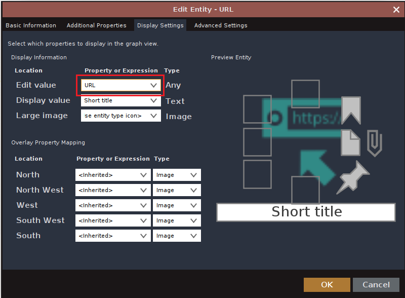

### Crawl the Web Like a Reptile


Version: 1.0.0-beta

Release: 27 July, 2023

## 💎 About

Scrape web pages by their URL into Maltego entities. This is a noisy🔊 form of reconaissance, VPN recommended if OPSEC is a concern.

Please use this tool ethically by respecting people's privacy and only collecting intelligence where explicit permission has been granted or otherwise legally qualified to do so. We are not responsible for any illegal use.

## 🛠️ Setup

### Requirements
- Maltego 4.3.0
- [Python 3.11.2](./requirements.txt)
   
### Installation
```
   git clone https://github.com/kodamaChameleon/webtile-maltego.git
   cd webtile-maltego
   python3 setup.py
```

🚨 **Important!** The "Edit value" for the URL entity must be set to URL. You can check/edit this by going to Entities -> Manage Entities -> URL (...) -> Display Settings. Some versions of Maltego default to Short title which does not include the necessary protocol or full path for these transforms to function correctly.


   
## 🧙 Features


| Name       | Description                                            | Input Type    | Output Type          | Notes                                                                                 |
|------------|--------------------------------------------------------|---------------|----------------------|---------------------------------------------------------------------------------------|
| imgToHash  | Returns perceptual hash of an image                    | maltego.Image | maltego.HashTag      | Use "To Images [Found on web page]" for initial scrape                                |
| urlToAlias | Scrape url for alias (aka. reverse WhatsMyName lookup) | maltego.URL   | maltego.Alias        | Pairs well with [Maltego-WhatsMyName](https://github.com/TURROKS/Maltego_WhatsMyName) |
| urlToDate  | Scrape url for dates                                   | maltego.URL   | maltego.DateTime     |                                                                                       |
| urlToEmail | Scrape url for email addresses                         | maltego.URL   | maltego.EmailAddress |                                                                                       |
| urlToPhone | Scrape url for phone numbers                           | maltego.URL   | maltego.PhoneNumber  |                                                                                       |

*Have another recommended entity type to scrape? Great! Let us know by creating an issue.*
   
## 📜 License


[Creative Commons Attribution-ShareAlike 4.0 International License](https://creativecommons.org/licenses/by-sa/4.0/)  
Copyright (C) 2023 KodamaChameleon
