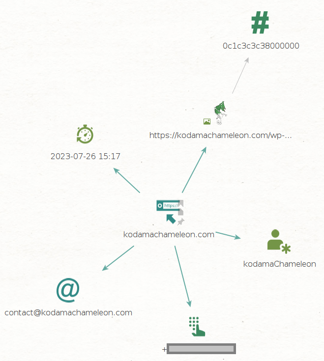

# Webtile
### Crawl the Web Like a Reptile


[](https://www.python.org/)

Version: 1.0.0-beta

Release: TBD

## 💎 About

Scrape web pages by their URL into Maltego entities.

Please use this tool ethically by respecting people's privacy and only collecting intelligence where explicit permission has been granted or otherwise legally qualified to do so. We are not responsible for any illegal use.

## 🛠️ Setup

### Requirements
- Maltego 4.3.0
- Python 3.11.2
   - maltego-trx 1.6.0
   
### Installation
```
   cd ~/.local/bin
   git clone https://github.com/kodamaChameleon/webtile-maltego.git
   cd webtile-maltego
   python3 setup.py
```
   
## 🧙 Features



| Name       | Description                                            | Input Type    | Output Type          |
|------------|--------------------------------------------------------|---------------|----------------------|
| imgToHash  | Returns perceptual hash of an image                    | maltego.Image | maltego.HashTag      |
| urlToAlias | Scrape url for alias (aka. reverse WhatsMyName lookup) | maltego.URL   | maltego.Alias        |
| urlToDate  | Scrape url for dates                                   | maltego.URL   | maltego.DateTime     |
| urlToEmail | Scrape url for email addresses                         | maltego.URL   | maltego.EmailAddress |
| urlToPhone | Scrape url for phone numbers                           | maltego.URL   | maltego.PhoneNumber  |
   
## 📜 License


[Creative Commons Attribution-ShareAlike 4.0 International License](https://creativecommons.org/licenses/by-sa/4.0/)  
Copyright (C) 2023 KodamaChameleon
